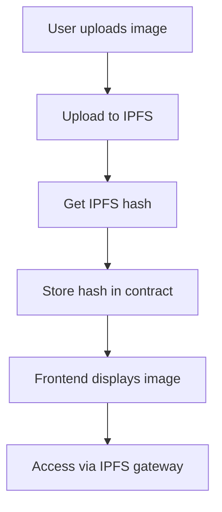

# IPFS Configuration Guide

## 📸 Image Storage Solution

### Current Implementation
1. **Image Upload to IPFS**: Use Pinata service to permanently store images on IPFS network
2. **Metadata Storage**: IPFS hash of images stored in smart contracts
3. **Off-chain Storage**: Images themselves are not stored on blockchain, only references are stored

### Configure IPFS Upload

#### 1. Get Pinata API Key
1. Visit [Pinata Cloud](https://app.pinata.cloud/)
2. Register account and login
3. Create new JWT Token in API Keys page
4. Copy JWT Token

#### 2. Configure Environment Variables
Add to `frontend/.env` file:
```env
REACT_APP_PINATA_JWT=your-pinata-jwt-token-here
REACT_APP_IPFS_GATEWAY=https://gateway.pinata.cloud
```

#### 3. Restart Frontend Service
```bash
cd frontend
npm run dev
```

### NFT Expiration Handling

#### Expiration Status Display
- **Upcoming**: Not started yet
- **Active**: Currently in progress
- **Expired**: Already expired

#### Functions After Expiration
1. **View History**: Expired NFTs can still be viewed in detail
2. **Image Display**: Images on IPFS are permanently saved and won't expire
3. **Participation Restriction**: Expired NFTs cannot continue to participate
4. **Claim NFT**: Users who have participated can still claim NFTs

### Image URL Processing Flow



### Troubleshooting

#### If IPFS Upload Fails
- System will automatically use mock data
- Images will display default placeholders
- Won't affect NFT contract creation

#### If IPFS Gateway is Unreachable
- System will try multiple gateways
- Including Pinata, Infura, Cloudflare, etc.
- Ensure images can display normally

### Security Considerations

1. **Decentralized Storage**: IPFS ensures images won't be lost due to single server failure
2. **Permanent Storage**: Once uploaded to IPFS, images will be permanently saved
3. **Content Addressing**: Hash values ensure image content cannot be tampered with
4. **Multi-gateway Support**: Even if one gateway fails, other gateways can still access

### Cost Information

- **Pinata Free Plan**: 1GB storage per month, 1000 uploads
- **Paid Plan**: Billed based on storage volume and API call count
- **Self-hosted IPFS Node**: Can avoid third-party service fees
